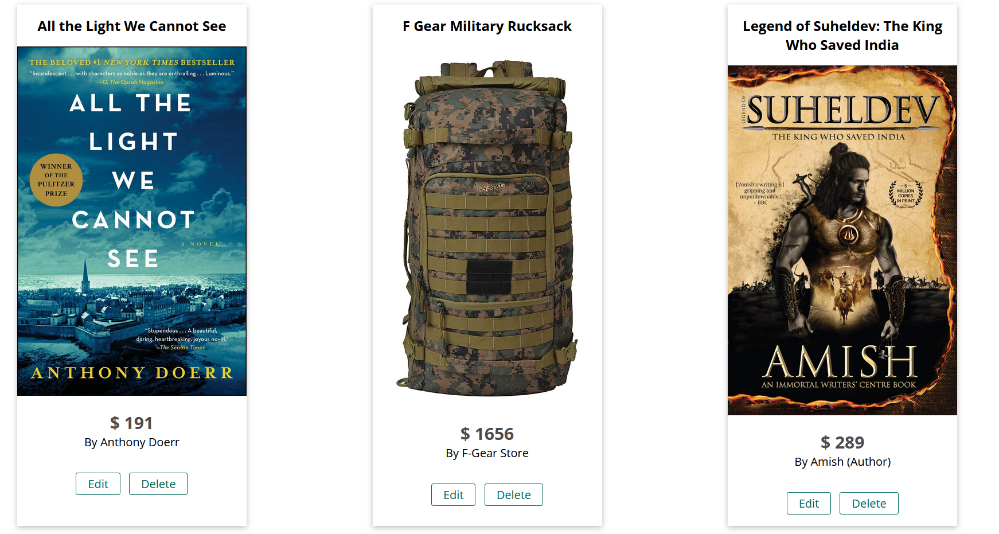
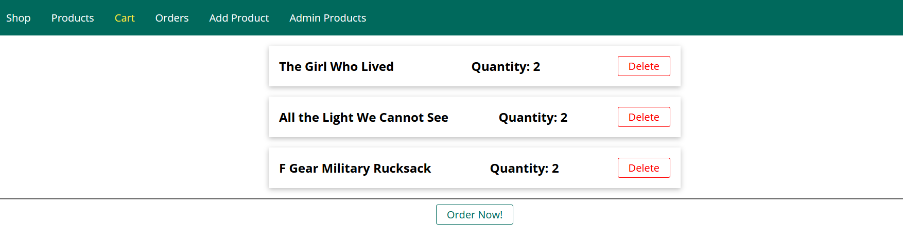
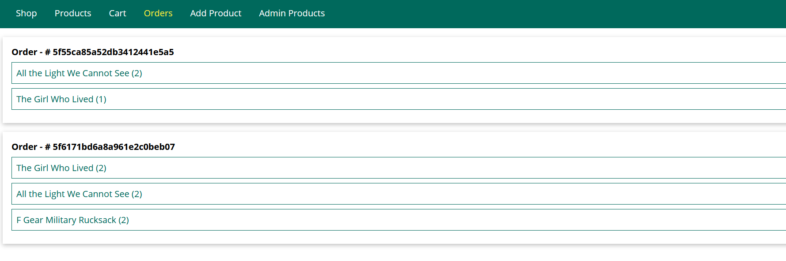
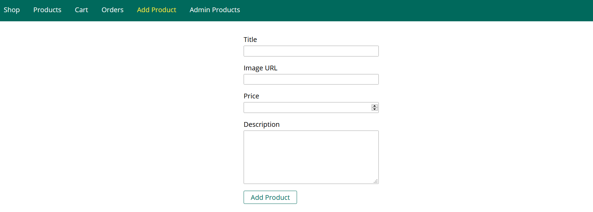
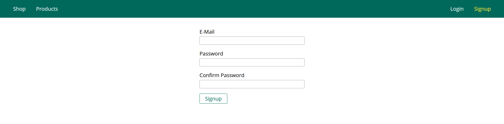
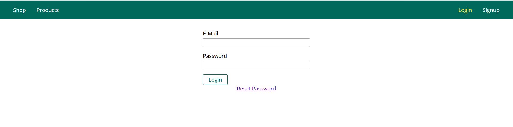

# Worth IT - Ecommerce Web Application
Created Web Application with Node.js, Express.js and MongoDB.

### Table of Contents
* [Technologies](#Technologies)
* [Illustrations](#Illustrations)
* [Features](#Features)

### Technologies
Project is created with:
* Node.js
* Express.js
* MongoDB
* Mongoose
### Illustrations
* Home Page

* Cart

* Orders

* Add Product

* Sign Up

* Login

### Features
* MVC(Model View Controller) Pattern Used
* Dynamic Routes and Query Parameters
* Sessions and Cookies Used
* Authentication and Authorization
* CRUD Operations
